# The Doge Trader Evidence

Open labhard-ftk.001 with AccessData FTK Imager and locate to Recycle Bin.

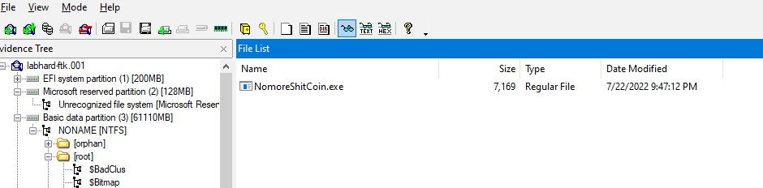

Export NomoreShitCoin.exe and run it on VM

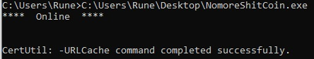

Run until you found compressed.zip in C:\Windows\System32

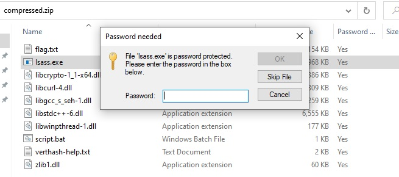

It's password protected zip file.

Check detail with 

```
bkcrack -L compressed.zip
```

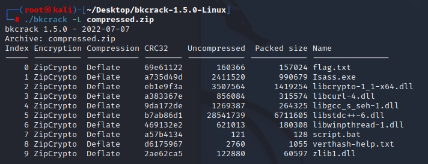

It's ZipCrypto Deflate. This one can use Known Plaintext Attack.

You need to get some file that exist in encrypted archive to perform Known Plaintext Attack.

I choose libcrypto-1_1-x64.dll

You can get it from AccessData FTK Imager. Locate to C:\Windows\System32.

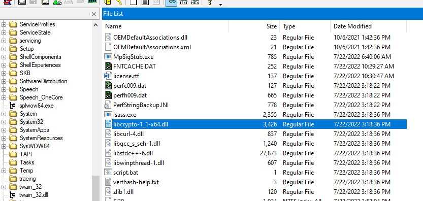

It's ZipCrypto "Deflate" so you need to try to find a compression method that compressed size = packed size in encrypted archive - 12.

I compress it using 7zip with these settings.

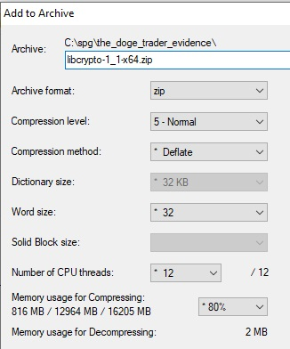

Check it with bkcrack

```
./bkcrack -L compressed.zip
./bkcrack -L libcrypto-1_1-x64.zip
```

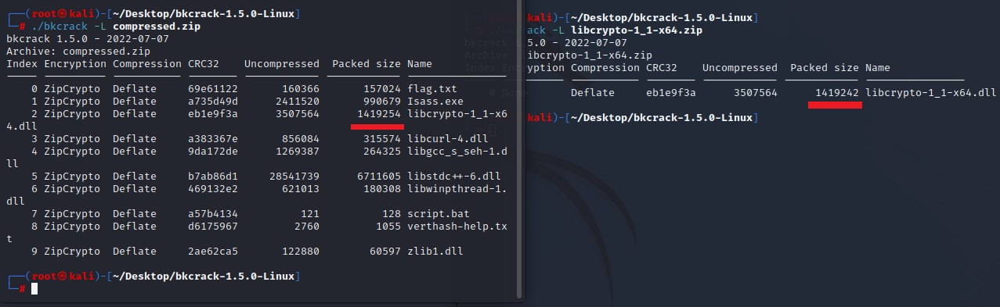

1419254-1419242 = 12

So it's correct. Let's crack it with bkcrack.

```
./bkcrack -C compressed.zip -c libcrypto-1_1-x64.dll -P libcrypto-1_1-x64.zip -p libcrypto-1_1-x64.dll
```

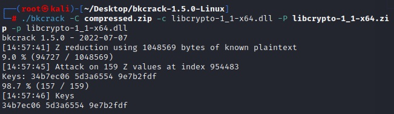

The key is 34b7ec06 5d3a6554 9e7b2fdf

I'll change zip password to 123456

```
./bkcrack -C compressed.zip -k 34b7ec06 5d3a6554 9e7b2fdf -U cracked.zip 123456
```

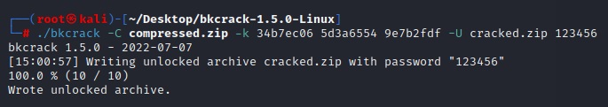

You can extract flag.txt but it's microsoft word document.

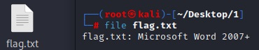

You can unzip it.

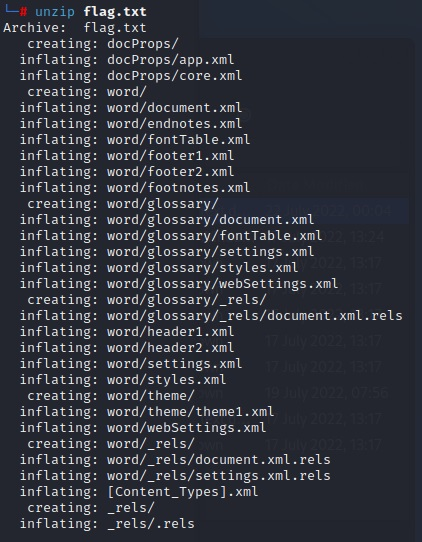

Found pastebin link inside \./word/_rels/settings.xml.rels

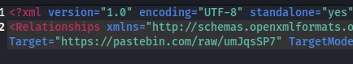

It's base-64 encoded string. After decoded it you'll get flag.

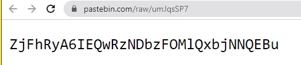


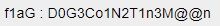

<b>Forensics{D0G3Co1N2T1n3M@@n}</b>
